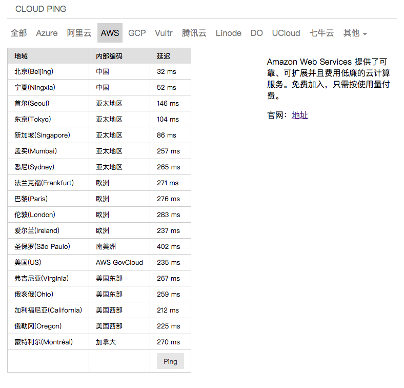

# Cloud Ping

Visit http://cloudping.bastionhost.org/ for all clouds!

This project has the following basic apps:

* ping - the core app which implement the main logic.

## Installation

To set up a development environment quickly, install Python 2.x first. It
comes with virtualenv built-in. so create a virtual environment with:

`mkvirtualenv cloudping`

Install dependencies:

`pip install -r requirements.txt`

Run server:

`python manage.py runserver --settings=cloudping.settings.development`

## Cloud endpoints

* Microsoft Azure: https://azure.microsoft.com/zh-cn/regions/
* AWS: http://ec2-reachability.amazonaws.com/
* Digital Ocean: http://speedtest-nyc1.digitalocean.com/
* Google Cloud: https://cloud.google.com/compute/docs/regions-zones/
* 腾讯云: https://cloud.tencent.com/document/product/213/6091
* 百度云: https://cloud.baidu.com/doc/BOS/S3.html#.E6.9C.8D.E5.8A.A1.E5.9F.9F.E5.90.8D
* 七牛云: https://developer.qiniu.com/kodo/manual/1671/region-endpoint
* 青云: https://docs.qingcloud.com/qingstor/api/common/overview.html#地址构成
* Vultr: https://www.vultr.com/faq/#downloadspeedtests
* 阿里云: https://help.aliyun.com/document_detail/40654.html
* 金山云: https://docs.ksyun.com/directories/1782
* UCloud：
* Linode：
* 美团云：
* 华为云：

## Refs

* Project generated by [https://github.com/huifenqi/django-project-skeleton](https://github.com/huifenqi/django-project-skeleton)
* Some js code comes from [http://www.cloudping.info/](http://www.cloudping.info/)
